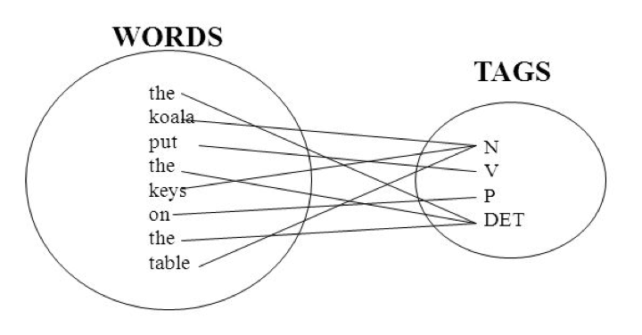
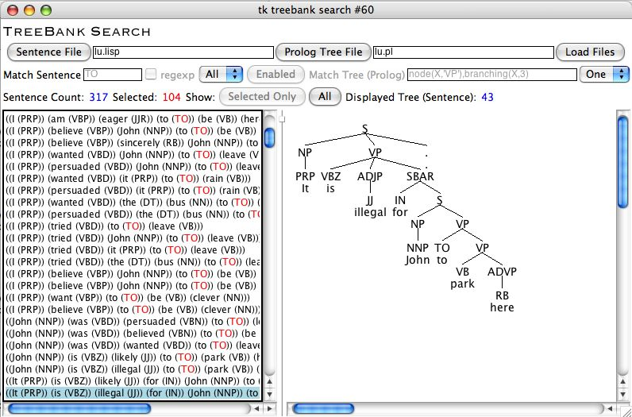

## Outline

> 1. Advanced corpus query
> 2. Corpus Annotation
> 3. Annotation tools: Basics

---
## What you've learned so far

- Using existing corpus tools (`Antocont` and `Word Sketch Engine`) to **build** and **query/extract** different linguistic patterns (`concordance`, `collocates`, `keywords`, `n-grams`,... and `concgram`, BTW)
- The underlying statistic thinking will be discussed later. 

--- .cover .w #FitToWidth

## Concgram revisted 

---
## An interesting idea (to be argued about)

- Linguistically speaking, related pairs, triplets, quadruplets (etc.) of words can be observed within a range of contexts.
- By definition, a 'concgram' is all of the permutations of constituency variation and positional variation generated by the association of two or more words. (so you have *two-words concgram*)

---
## A bit more about Corpus Query

- First look at [Netspeak](http://www.netspeak.org/)
- `Simple Query Syntax` in [BNCweb](http://bncweb.lancs.ac.uk)
- `Corpus Query Language (CQL)` in Word Sketch Engine

---
## Exercise

---
## Outline

1. Advanced corpus query
2. __**Corpus Annotation**__
3. Annotation tools: Basics

---
## Corpus Annotation

- Annotation is widely accepted as a crucial contribution to the benefit a corpus brings, for it enriches the corpus as a source of linguistic information for research and applications.
- It can be defined as the practice/art of adding `interpretative, linguistic, or paralinguistic information` to a digitalized corpus of written and/or spoken data.  

---
## Corpus Annotation
### annotation vs markup

- **Annotation** refers specifically to linguistic information encoded in the text, while **Markup** refers to non-linguistic information encoded in the text (a.k.a. *meta-data*).
- Some would take annotation as one type of markup in the corpus.

---
## Types of annotation

- Typical case of annotation is **grammatical tagging**, in which a *POS tag* is attached to a word to indicate its grammatical class.
- **Granuality**: Brown corpus tagset (87 tags), Penn treebank tagset (45 tags), C7 tagsets (146 tags).

---
## Types of annotation

- **Grammatical annotation** should not be confused with **Syntactic annotation** (`treebank`: syntactically annotated corpus)

---
## Type of annotation

- **Linguistic levels** of corpus annotation:
  - Phonetic/Prosodic/POS/Syntactic/Semantic/Discoursal/Pragmatic/Stylistic  
- **Paralinguistic levels** of corpus annotation:
  - Emotion/Affect/Personality
- **Conceptual levels** 
  - ontological class

---
## Corpus Annotation: Why

- Information Extraction and NLP
  - e.g., the orthographic form itself does not reveal how *versatile* the word 'left' is.
  - e.g., a speech synthesizer will need to distinguish the noun from the verb, if it is to produce a correct pronunciation.
- Re-usability

---
## Annotation schemes

An annotation scheme should contain at least:
- a list of symbols used and a definition of their meaning
- specification of how decisions are made about how to attach information to linguistic units.

---
## Corpus Annotation: Tools

- [GATE](http://gate.ac.uk)
- [ANNIS/Atomic](http://corpus-tools.org): A web browser-based search and visualization architecture for complex multilayer linguistic corpora with diverse types of annotation. 
- [LOPE.anno](http://140.112.147.121:8001/lope.anno/)

---
## GATE

> An infrastructure for developing and deploying software components that process human language. GATE helps scientists and developers in three ways

1. by specifiying an architecture, or organisational structure, for language processing software; 
2. by providing a framework, or class library, that implements the
architecture and can be used to embed language processing capabilities in diverse applications;
3. by providing a development environment built on top of the framework made up of convenient graphical tools for developing components

---
## GATE 

Walk through basic [learning modules](https://gate.ac.uk/demos/developer-videos)

- GATE Developer interface
- Loading and Viewing Documents and Corpus (`language resources`)
- Using `Processing Resources`
- Creating and Loading `Applications` and Runtime Parameters
- `Annotations`
- `Data Stores` and Saving Applications

---
## Lab: Annotation Practice

- Installation
- Familiarizing the Interface

---
## Loading, Setting and Viewing

- load document into *gate* document.

---
## Homework (20151030)

- Watch **FutureLearn** (Week4, 4.1-4.10) and write a reflective note.
- (Group work) Design a cross-strait MM-TM historical ('comparable') corpus in political domain as the data pool for term projects, and propose some possible research topics. Present your proposal in the next class.

[Ref]
1. 人民日報
2. 聯合報

---
## Comparable corpus

> A comparable corpus can be defined as a corpuscontaining components that are collected using the same sampling frameand similar balance and representativeness (cf. McEnery, 2003: 450), e.g.the same proportions of the texts of the same genres in the same domains
ina range of different languages in the same sampling period. 

